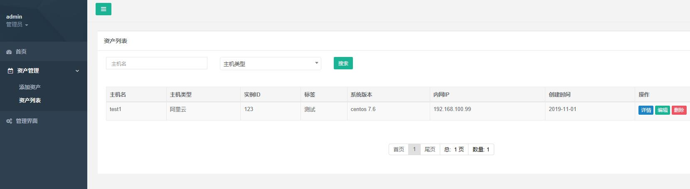
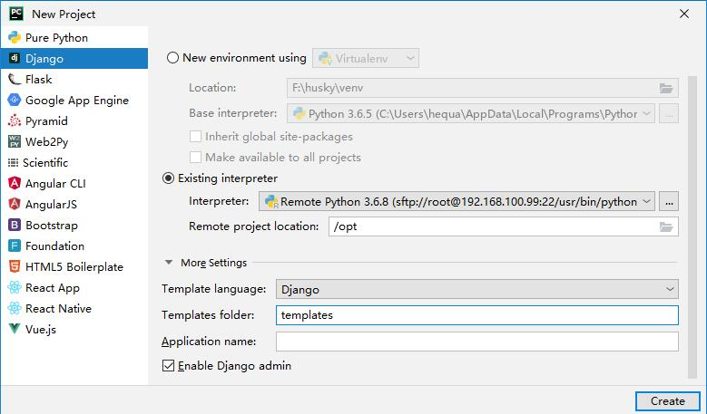

[简体中文](README.md) | [English](README.en.md)

# pandaAdmin (Back-end)

> Author: He Quan (何全)，GitHub: <https://github.com/hequan2017>，QQ group: 620176501

> This tutorial series takes you from zero to independently writing a simple CMDB system.

> There are two mainstream development approaches: MVC and MVVC. This project provides beginner tutorials for both MVC and MVVC (separated front-end/back-end).

## Introduction

pandaAdmin is the companion project of the "Getting Started with a Django CMDB System" tutorial series: based on Django 2.2 + DRF 3.10 + MySQL and written with class-based views (CBV), it implements token authentication, a user-info endpoint, and a complete CRUD example (the `test` table), plus auto-generated API docs and the Django admin site. It serves the [panda](https://github.com/hequan2017/panda) front-end and suits anyone getting started with Django web / CMDB development.

## 📖 Tutorial




[Django CMDB Tutorial (1) — Base Environment](doc/1.md)

[Django CMDB Tutorial (2) — Front-end Templates](doc/2.md)

[Django CMDB Tutorial (3) — Login & Logout](doc/3.md)

[Django CMDB Tutorial (4) — CRUD](doc/4.md)

[Django CMDB Tutorial (5) — Separated Front-end](doc/5.md)

[Django CMDB Tutorial (6) — Separated Back-end](doc/6.md)

## ✨ Features

- Token authentication: obtain a DRF token at `/token`; Basic / Token / Session authentication supported
- Endpoints: `/system/user_info` (user info), `/system/logout` (logout), `/system/test` and `/system/test/{id}` (CRUD example)
- Auto-generated API docs at `/docs` (with a browsable web UI; can be disabled in settings)
- Django admin at `/admin`; a custom Users model extending AbstractUser (adds position, avatar and mobile fields)
- CORS support (django-cors-headers) for front-end/back-end development
- Sample Kubernetes deployment YAMLs in the `system/k8s/` directory

## 🛠 Tech Stack

- MVC / MVVC mode, class-based views (CBV)
- CentOS 7.6, Python 3.6, Django 2.2, MySQL 5.7, PyCharm 2019.2 (remote development on CentOS from Windows)
- DRF 3.10.3, django-cors-headers, celery 4.3, mysqlclient (full list in `requirements.txt`)

## 🚀 Quick Start

```bash
git clone https://github.com/hequan2017/pandaAdmin.git
cd pandaAdmin
pip3 install -r requirements.txt

# Edit HOST/PORT/NAME/USER/PASSWORD in DATABASES of pandaAdmin/settings.py

python manage.py makemigrations
python manage.py migrate
python manage.py createsuperuser
python manage.py runserver 0.0.0.0:8000
```

Endpoints:

```text
POST /token                Log in and obtain a token (username/password)
POST /system/user_info     Get user info
POST /system/logout        Log out
GET/POST /system/test      Test table: list / create
GET/PUT/DELETE /system/test/{id}   Test table: retrieve / update / delete
```

For detailed environment setup (Python 3.6 on CentOS 7.6), Docker-based MySQL 5.7 deployment and PyCharm remote development, see tutorial `doc/1.md`.

PyCharm remote development setup (ssh interpreter):



## 🔗 Related Projects

- Front-end: <https://github.com/hequan2017/panda>

## 📄 License

[MIT](LICENSE)

## Author

- He Quan (何全)，GitHub: <https://github.com/hequan2017>，QQ group: 620176501
